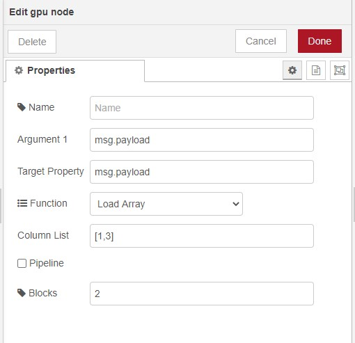

# node-red-contrib-gpu

[Node Red][1] interface to gpu using [gpu.js][4].
Input is one or more arrays or images that are passed in a message.
An array can represent a 1,2 or 3 dimensional matrix.
Due to the overhead GPU is only efficient where input arrays are of a considerable size.

There is plenty of scope for this node to be enhanced to take advantage of [gpu.js][4] features.
For example, more standard function, dynamic functions, multi function access to minimise externalisation from GPU between functions.

------------------------------------------------------------

# gpu

This node can be found in function and has form below.
Argument 1 is the name of property containing first argument to function.
Argument 2 is the name of property containing second argument to function.
Target Property where the response is place.
Arguments can be numbers or arrays of numbers.
Result will change depending on function and data types passed in arguments.

There are 3 ports. One for success, second for failure and third if GPU not supported by hardware.
The last allows CPU based equivalents to be implemented so flow can be hardware agnostic.

Pipeline allows information to be retained in GPU between nodes minimising overhead of loading and unloading GPU.

 

Functions
* Add Array
* Subtract Array
* Multiply Array
* Divide Array/option>
* Remainder Array
* Power Array
* Bitwise And Array
* Bitwise Or Array
* Bitwise XOR Array
* Load array into pipeline
* Left Shift Array
* Right Shift Array
* Right Shift Zero Fill Array
* Matrix Multiple Arrays
* Sum Columns
* Sum Rows
* Statistics average, standard deviation, skewness
* Moments average,variance, skewness
* Covariance 
* Correlation Coefficients (Pearson)
* Image To Array
* Transpose

------------------------------------------------------------

# Install

Run the following command in the root directory of your Node-RED install or via GUI install

	npm install node-red-contrib-gpu

------------------------------------------------------------

# Version

0.1.1 Even more bug fixes, expanded blocking, pipeline, columns/rows and select column scope.

0.1.0 Even more bug fixes added pipelining, load 2d array into 3d using sizing, select columns for stats metrics

0.0.2 Loads of bug fixes. Added more robust tests

0.0.1 base

# Author

[Peter Prib][3]

[1]: http://nodered.org "node-red home page"

[2]: https://www.npmjs.com/package/node-red-contrib-gpu "source code"

[3]: https://github.com/peterprib "base github"

[4]: https://github.com/gpujs/gpu.js "gpu.js"